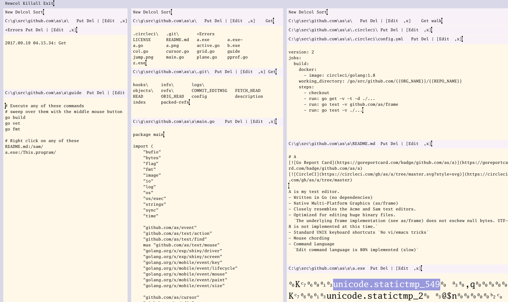
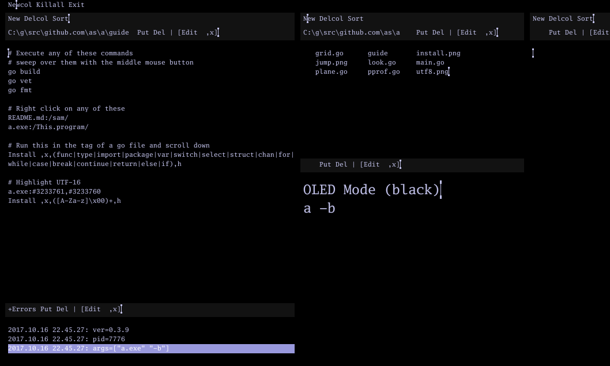

# A
[](https://goreportcard.com/badge/github.com/as/a)
[](https://circleci.com/gh/as/a/tree/master)

A is a text editor inspired by the Sam and Acme text editors for the Plan 9 operating system.

# binary 



- Latest Binaries
	- https://github.com/as/a/releases/tag/v0.7.3
- Written in Go (no dependencies)
	- Native
	- Multi-Platform
	- Graphical (http://github.com/as/frame)
	- Not CGo
	- Not a port/transpilation 
- Resembles Acme and Sam text editors.
	- Mouse chording
	- Text is executable
	- Standard UNIX keyboard shortcuts
	- Implements the Edit command language
	- Plumbing
- Graphics
	- Frame implementation stores bytes and works with '\0'
	- UTF-8 rendering support 
	- Structure highlighting
	- Image support (TBD)
- Files
	- Optimized for editing huge binary files.


# note

This repository is still in the alpha stage, and frequently changes. The program comes with
no warranty expressed or implied. 

# install or build

Binary releases for linux, windows, and darwin are available for v0.6.7+. You can install
from source on these systems by running:

`go get -u -t github.com/as/a`

If you want to install a prior version (v0.5.5, for example, which uses the original exp/shiny)

```
go get github.com/as/a
go get github.com/golang/vgo
cd $GOPATH/src/github.com/as/a
git checkout v0.5.5-release 
vgo build
```

You can also build the latest with vgo, but vgo is not necessary for that

```
git checkout master
vgo build
```

# usage
a [file ...]

# differences and issues
- Compare to the true Acme
https://github.com/as/a/wiki/Alterations

- issues

https://github.com/as/a/issues

# hints
To reshape the windows and columns, click on the invisible 10x10px sizer that I haven't rendered yet with the left mouse button. 
Hold the button down and move the window to the location. 
Release the button.

# edit
- 80% of the sam command language is implemented.

Edit ,x,the standard editor is any editor,x,any editor,c,ed,

# commands
- Currently only in CWD
- Put ```[go build]``` in the tag
- Double click inside ```[```
- Middle click to execute

# look
- Right click on a string
- If its a file, it will open it
- If win32, it will also move the mouse
- if you highlight a valid mode in the guru tag, right clicking in a go source file will run guru on that selection

# mouse
```
1 Select text/sweep
1-2 Snarf (cut)
1-3 Paste
2 Execute select
3 Look select
```

# keyboard
```
^U  Delete from cursor to start of line.
^W  Delete word before the cursor.
^H  Delete character before the cursor.
^A  Move cursor to start of the line.
^E  Move cursor to end of the line.
^+  Increase font size
^-  Decrease font size
^i	Run goimports (in a tag ending in .go)
```

# extras
- Looking (right click) in the main tag finds the result in all open windows
    

# future
- Fixing the bugs
- Cleaning the code up
- Live multi-client editing
- Go specific ast/compiler stuff
- Better CMD exec
- File system interface to shiny events

# see also
History of good text editors

- `The Acme User Interface for Programmers` (Rob Pike)
- `A Tutorial for the Sam Command Language` (Rob Pike)
- Plan 9 
- Inferno
- Acme SAC
