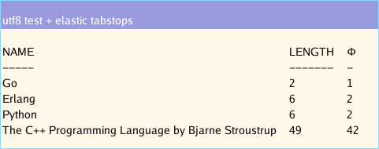

## Frame 
[](https://goreportcard.com/report/github.com/as/frame)

## Synopsis

Package frame implements graphical, editable text widgets compatible with Plan 9's libframe(3). Unlike libframe, the text is
byte-addressed and preserves NUL terminated strings. The related `github.com/as/font` package provides a superset of the
`golang.org/x/font.Face` interface and implements additional functionality for working with Go fonts and frames.



## Installation

```
	go get -d -u github.com/as/frame/...
```

## Updates

NOTE: The API has changed since this README.md was updated. 

- The font functionality is no longer embedded in the frame package
- The frame.New constructor package function has been modified to take a Config struct

Run the provided gofix program under to programatically update your packages:

```
	go get -u github.com/as/frame/...
	go install github.com/as/frame/framefix
	framefix github.com/as/ui
```

## Description

A Frame is a graphical text container. It draws text on a bitmap, using previously-drawn text as a cache. 

Create one using New:

```
  dst := image.NewRGBA( image.Rect(0,0,100,100), 
  f := frame.New(dst, dst.Bounds(), &Config struct {
		Color: frame.Mono,
        Font : font.NewFace(12), 
   }
```

## Rendering

The most frequent operations are Insert and Delete. Insert renders text at a given offset without overwriting existing
text. Delete deletes a range of text and moves existing text after it into its range. Ranges are defined by two integers
and behave equivalently to Go slice indices.

Insert and delete are inverses.

```
f.Insert([]byte("hello world."), 0)
f.Delete(0, 11)
```

## Projection

`PointOf` projects the index of a character to a 2D image.Point on the image. `IndexOf` does the opposite, projecting
an index to a point.

They are also inverse operations.

```
	f.InsertString("hello")
	f.IndexOf(f.PointOf(4))	// returns: 4
	f.PointOf(f.IndexOf(image.Pt(25,25))) // returns: (25, 25)
```

There is no method for extracting the values of characters in the frame. The data structures are designed to be fast write-only containers.


## Selection

Frames select a continuous range of text with `Select`. The currently-selected range is queried with `Dot`.

```
	f.InsertString("hello")
	f.Select(0,2)
	f.Dot()	// returns (0,2)
```


## Drawing

Because the bitmap is an arbitrary image and also a living cache of glyphs, drawing
on the bitmap between rendering operations persists on the underlying glyphs. There
are a few ways to re-render the bitmap or a region of it.


```
Recolor(pt image.Point, p0, p1 int64, cols Palette)
  Recolor colors the range p0:p1 by redrawing the foreground, background, and font glyphs

Redraw(pt image.Point, p0, p1 int64, issel bool)
  Redraw redraws the characters between p0:p1. It accesses the cache of drawn glyph widths
  to avoid remeasuring strings

RedrawAt(pt image.Point, text, back image.Image)
  RedrawAt refreshes the entire image to the right of the given pt. Everything below is redrawn.

Refresh()
  Refresh recomputes the state of the frame from scratch. This is an expensive operation compared
  to redraw

Paint(pt0, pt1 image.Point, col image.Image)
  Paint paints the color col on the frame at points pt0-pt1. The result is a Z shaped fill
  consisting of at-most 3 rectangles. No text is redrawn.
```

## Examples

- Basic
https://github.com/as/frame/blob/master/example/basic/basic.go

- UTF-8
https://github.com/as/frame/blob/master/example/utf8/utf8.go

- Elastic
https://github.com/as/frame/blob/master/example/elastic/elastic.go


## Feature Set

- UTF8
- ASCII
- Elastic tabstops
- Semantic replacement characters

# Note

A frame's text is not addressable. Once the characters are written to the frame, there is no
mechanism to retrieve value from within the frame. Use a buffer to store text for reading
and the range addresses of the frame to access bytes from that buffer.

See `github.com/as/ui/win` for an example.

## See Also

http://doc.cat-v.org/plan_9/4th_edition/papers/sam/

Specifically, the section `Data structures in the terminal` served as a guide
